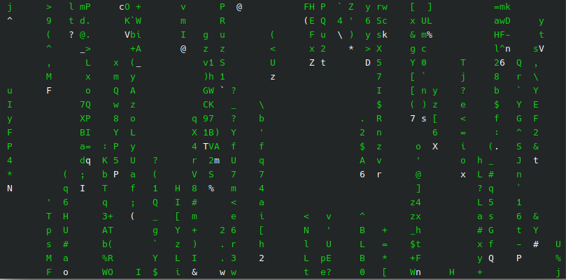

# eMatrix
eMatrix is inspired from [cMatrix](github.com/abishekvashok/cmatrix) which is inspired from the screensaver from [The Matrix](https://en.wikipedia.org/wiki/The_Matrix). It implements the iconic scrolling-cryptic-green-text-on-black-terminal screen from The Matrix.

# Compiling
Use the provided makefile by running `make` to compile.

# Usage
Use `./matrix` to run. Press any key to exit.

# Sample
